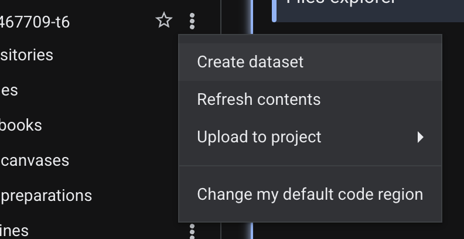
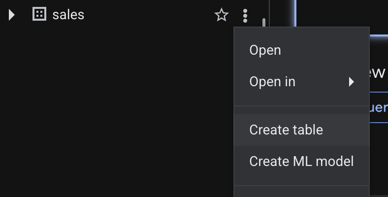
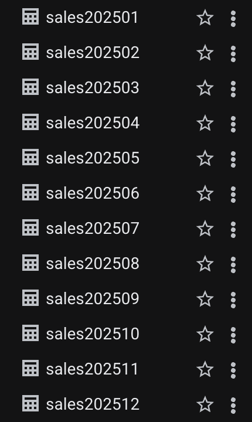
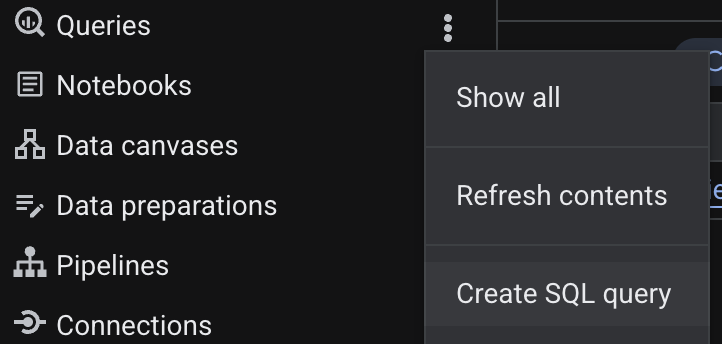
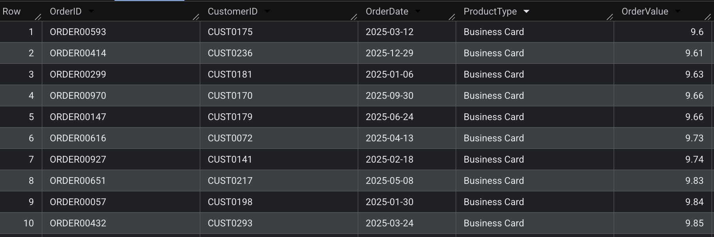
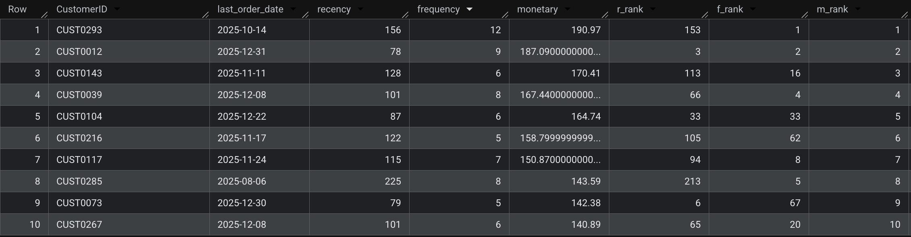
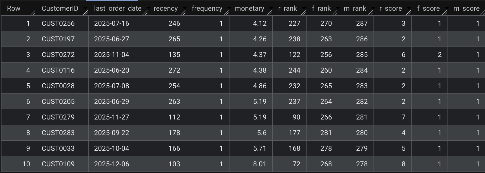
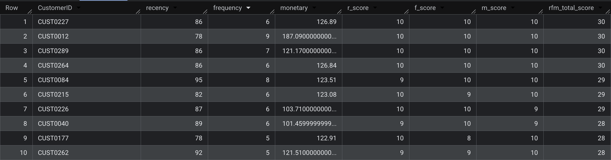
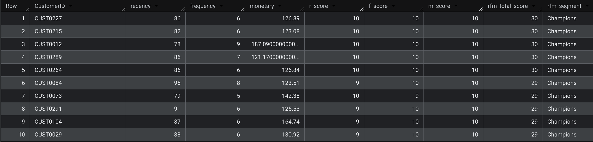

# RFM Sales Analysis

## Project Overview

Developed an end-to-end **RFM (Recency, Frequency, Monetary)** segmentation pipeline in Google BigQuery to categorize customer behavior and identify high-value customer segments. Engineered SQL scripts for data transformation, aggregation, and customer segmentation, then created an interactive Power BI dashboard for visualization and business insights.

---

## How This Project Was Built

### Step 1: Create a New Dataset in BigQuery

1. Open **Google BigQuery Console**
2. In the left sidebar, click on your **Project ID**
3. Click the **"+ CREATE DATASET"** button
4. Name the dataset as `sales`
5. Leave other settings as default and click **Create**

> 

---

### Step 2: Import Monthly Sales Data as Tables

1. In the **sales** dataset, click **"+ CREATE TABLE"**
2. For each of the 12 monthly CSV files (202501.csv - 202512.csv):
   - **Source**: Upload from your local files
   - **Table name**: `sales202501`, `sales202502`, ... `sales202512` (matching the month)
   - **Schema**: Auto-detect
   - Click **Create table**

3. After all 12 tables are created, you should have the following tables in your sales dataset:
   - sales202501, sales202502, sales202503, sales202504, sales202505, sales202506
   - sales202507, sales202508, sales202509, sales202510, sales202511, sales202512

> 
> 

---

### Step 3: Create SQL Query File

1. In the BigQuery console, click on the **Queries** tab
2. Click **"+ CREATE QUERY"**
3. Copy and paste all the SQL queries from the `sales Queries.sql` file
4. Replace all instances of `<Project ID>` with your actual BigQuery Project ID
5. Save the query as `sales Queries`

> 

---

### Step 4: Execute SQL Queries & Create Data Transformations

#### **Query 1: Combine All Monthly Tables into One Annual Table**

**What it does:**
- Merges all 12 monthly sales tables (202501-202512) into a single comprehensive table named `sales2025`
- Uses `UNION ALL` to append rows from each month without removing duplicates
- Creates a complete dataset for the entire year of 2025

**SQL:**
```sql
CREATE OR REPLACE TABLE `<Project ID>.sales.sales2025` AS
SELECT * FROM `<Project ID>.sales.sales202501`
UNION ALL SELECT * FROM `<Project ID>.sales.sales202502`
UNION ALL SELECT * FROM `<Project ID>.sales.sales202503`
UNION ALL SELECT * FROM `<Project ID>.sales.sales202504`
UNION ALL SELECT * FROM `<Project ID>.sales.sales202505`
UNION ALL SELECT * FROM `<Project ID>.sales.sales202506`
UNION ALL SELECT * FROM `<Project ID>.sales.sales202507`
UNION ALL SELECT * FROM `<Project ID>.sales.sales202508`
UNION ALL SELECT * FROM `<Project ID>.sales.sales202509`
UNION ALL SELECT * FROM `<Project ID>.sales.sales202510`
UNION ALL SELECT * FROM `<Project ID>.sales.sales202511`
UNION ALL SELECT * FROM `<Project ID>.sales.sales202512`;
```

**Output:** Table `sales2025` containing all combined sales data

> 

---

#### **Query 2: Calculate RFM Metrics & Ranks**

**What it does:**
- Calculates three core RFM metrics for each customer:
  - **Recency**: Days since the customer's last purchase
  - **Frequency**: Total number of orders placed by the customer
  - **Monetary**: Total revenue generated by the customer
- Assigns ranking based on each metric (ROW_NUMBER window function)
- Creates the `rfm_metrics` view as the foundation for RFM scoring

**Key Logic:**
- Recency is calculated as the difference between the analysis date (2026-03-19) and the customer's last order date
- Higher frequency and monetary values are ranked better (DESC order)

**SQL:**
```sql
CREATE OR REPLACE VIEW `<Project ID>.sales.rfm_metrics` 
AS
WITH current_date AS(
  SELECT DATE('2026-03-19') AS analysis_date
),
rfm AS (
  SELECT
    CustomerID,
    MAX(OrderDate) as last_order_date,
    DATE_DIFF((SELECT analysis_date FROM current_date), MAX(OrderDate), DAY) AS recency,
    COUNT(*) AS frequency,
    SUM(OrderValue) AS monetary
  FROM `<Project ID>.sales.sales2025`
  GROUP BY CustomerID
)
SELECT 
  rfm.*,
  ROW_NUMBER() OVER(ORDER BY recency ASC) AS r_rank, 
  ROW_NUMBER() OVER(ORDER BY frequency DESC) AS f_rank,
  ROW_NUMBER() OVER(ORDER BY monetary DESC) AS m_rank
FROM rfm;
```

**Output:** View `rfm_metrics` with columns: CustomerID, recency, frequency, monetary, r_rank, f_rank, m_rank

> 

---

#### **Query 3: Assign Decile Scores (RFM Scores)**

**What it does:**
- Converts the raw rankings into decile scores (1-10 scale) using the `NTILE()` window function
- **10** = Best performers
- **1** = Worst performers
- Scores are assigned separately for R, F, and M metrics
- Creates the `rfm_scores` view

**Key Logic:**
- `NTILE(10)` divides customers into 10 equal buckets based on ranking
- Higher scores indicate better recent purchases (R), more frequent purchases (F), and higher spending (M)

**SQL:**
```sql
CREATE OR REPLACE VIEW `<Project ID>.sales.rfm_scores` 
AS
SELECT 
  *,
  NTILE(10) OVER(ORDER BY r_rank DESC) AS r_score,
  NTILE(10) OVER(ORDER BY f_rank DESC) AS f_score,
  NTILE(10) OVER(ORDER BY m_rank DESC) AS m_score
FROM `<Project ID>.sales.rfm_metrics`;
```

**Output:** View `rfm_scores` with added columns: r_score, f_score, m_score (each ranging 1-10)

> 

---

#### **Query 4: Calculate Total RFM Score**

**What it does:**
- Sums the R, F, and M scores to create a single composite **RFM Total Score** (0-30 range)
- Selects only the most relevant columns
- Orders customers by their total score (best to worst)
- Creates the `rfm_total_scores` view

**Key Logic:**
- Total score = r_score + f_score + m_score
- Maximum possible score: 30 (10 + 10 + 10)
- Higher scores indicate high-value customers

**SQL:**
```sql
CREATE OR REPLACE VIEW `<Project ID>.sales.rfm_total_scores`
AS
SELECT 
  CustomerID,
  recency,
  frequency,
  monetary,
  r_score,
  f_score,
  m_score, 
  (r_score + f_score + m_score) as rfm_total_score
FROM `<Project ID>.sales.rfm_scores` 
ORDER BY rfm_total_score DESC;
```

**Output:** View `rfm_total_scores` with customers ranked by rfm_total_score from highest to lowest

> 

---

#### **Query 5: Create Customer Segments**

**What it does:**
- Translates RFM total scores into business-meaningful customer segments
- Creates 8 distinct customer categories using CASE statement logic
- Produces a **BI-ready final table** that connects directly to Power BI
- Creates the `rfm_segments_final` table

**Customer Segments:**
| Score Range | Segment | Meaning |
|---|---|---|
| 28-30 | **Champions** | Best customers, buy recently, frequently, and spend well |
| 24-27 | **Loyal VIPs** | High-value repeat customers |
| 20-23 | **Potential Loyalists** | Recent buyers with good frequency/spending |
| 16-19 | **Promising** | Capable of becoming loyal but need engagement |
| 12-15 | **Engaged** | Moderate activity, at risk of becoming inactive |
| 8-11 | **Requires Attention** | Low values, need targeted re-engagement |
| 4-7 | **At Risk** | Very low values, at high risk of churn |
| 0-3 | **Lost/Inactive** | No recent or minimal engagement |

**SQL:**
```sql
CREATE OR REPLACE TABLE `<Project ID>.sales.rfm_segments_final` 
AS
SELECT
  CustomerID,
  recency, 
  frequency, 
  monetary, 
  r_score,
  f_score,
  m_score, 
  rfm_total_score,
  CASE 
    WHEN rfm_total_score >= 28 THEN 'Champions'
    WHEN rfm_total_score >= 24 THEN 'Loyal VIPs' 
    WHEN rfm_total_score >= 20 THEN 'Potential Loyalists'
    WHEN rfm_total_score >= 16 THEN 'Promising'
    WHEN rfm_total_score >= 12 THEN 'Engaged'
    WHEN rfm_total_score >= 8 THEN 'Requires Attention'
    WHEN rfm_total_score >= 4 THEN 'At Risk' 
    ELSE 'Lost/Inactive'
  END AS rfm_segment
FROM `<Project ID>.sales.rfm_total_scores`
ORDER BY rfm_total_score DESC;
```

**Output:** Table `rfm_segments_final` with all RFM metrics and customer segments

> 

---

### Step 5: Connect to Power BI Dashboard

1. Open **Power BI Desktop**
2. Click **"Get Data"** → **"More..."** → Search for **"Google BigQuery"**
3. Enter your **Project ID** and authenticate with your Google account
4. Select the **sales** dataset
5. Choose the table **`rfm_segments_final`** as your primary data source
6. Use **"Import"** mode (since the dataset is finalized and won't change frequently)
7. Click **"Load"** to import the data into Power BI

**Data Model:**
- CustomerID (dimension)
- R, F, M metrics and scores (measures)
- RFM total score (measure)
- RFM segment (dimension for categorization)

8. Create visualizations such as:
   - Segment distribution (pie/donut chart)
   - Customer count by segment
   - Average metrics by segment
   - Trend analysis of RFM scores

> **Screenshot**: Add a screenshot of the Power BI dashboard with your visualizations

---

## Data Flow Summary

```
Monthly Sales Data (202501-202512) 
    ↓ (Step 1 Query)
sales2025 Table (Combined Annual Data)
    ↓ (Step 2 Query)
rfm_metrics View (R, F, M Calculations + Rankings)
    ↓ (Step 3 Query)
rfm_scores View (Decile Scoring 1-10)
    ↓ (Step 4 Query)
rfm_total_scores View (Combined RFM Score 0-30)
    ↓ (Step 5 Query)
rfm_segments_final Table (Customer Segments + Business Labels)
    ↓
Power BI Dashboard (Visualization & Business Insights)
```

---

## Key Technologies Used

- **Google BigQuery**: Cloud data warehouse for SQL processing and data storage
- **SQL**: Data transformation and RFM metric calculations
- **Power BI**: Business intelligence and dashboard visualization

---

## RFM Analysis Benefits

✅ Identify high-value customers (Champions)  
✅ Recognize at-risk customers before churn  
✅ Segment customers for targeted marketing campaigns  
✅ Prioritize resources toward most profitable customer groups  
✅ Measure customer engagement and lifetime value potential

